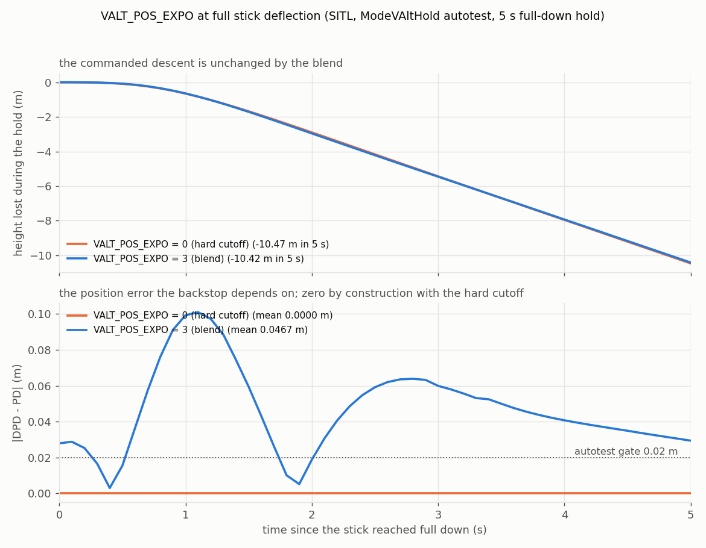

# PR #32270 - VALT velocity alt-hold flight mode

Analysis archive for [ArduPilot/ardupilot#32270](https://github.com/ArduPilot/ardupilot/pull/32270).
Branch `copter-valt-mode` (andyp1per fork), base `master`. No logs are
committed here; the validation is the `ModeVAltHold` autotest and real flights
that stay private.

## Status (one line)

Rebased onto master on 2026-08-29 (941 commits behind before) and extended with
three commits: ground idle at mid-stick, its autotest, and a position
correction limit in ground effect. Self-reviewed 2026-09-04
([write-up](self-review-2026-09-04.md)): @peterbarker's avoidance call was still
missing and is now restored, an inherited terrain offset was defeating the
mode's own zero-error premise, and `VALT_POS_EXPO` values at or below 1 are
inert. Code fixed and squashed back into the commits that introduced the
problems (old head 973cf77117, new head d6d572ad43, twelve commits, each
builds); not pushed, and the PR body is not yet updated. A maintainer's
objection to the mode's existence stands unanswered by design.

## What the mode is

The pilot stick commands climb/descent rate instead of driving a jerk-limited
position trajectory. VALT inherits from AltHold and overrides only the flying
state: off-centre, pos_desired snaps to the estimate (velocity control); at
centre it freezes with zero initial position error and the position loop holds.
Any baro offset accumulated during a manoeuvre cancels instead of feeding a
trajectory, which is the point on small, high disc-loading copters with heavy
baro ground effect. `VALT_POS_EXPO` (default 0, inert) blends position
authority back in with stick deflection so a stuck velocity loop has a backstop
at full deflection.

## The three additions

1. **Ground idle at mid-stick.** Mid-stick is VALT's resting hold state, but the
   shared AltHold ground state machine spools the motors up at any stick at or
   above mid while a take-off only triggers on a positive climb rate. Parked at
   mid-stick the vehicle sat spooled-but-not-taking-off with `land_complete`
   true; angle boost while the airframe was handled pushed `throttle_out` past
   hover/2 and the land detector's missing-take-off guard latched a
   `flow_of_control` internal error that blocked arming until power cycle. A
   `Mode::spool_up_at_zero_climb_on_ground()` virtual (default true) lets VALT
   stay in ground idle until a climb is commanded; every other mode is
   byte-identical. Side effects, stated in the message: take-off from mid-stick
   waits for the spool-up, and a parked VALT vehicle auto-disarms after
   `DISARM_DELAY` where AltHold would not.
2. **Autotest** for the ground phase: motor output at mid-stick must sit below
   AltHold's at the same stick (the discriminating observable), the vehicle
   stays landed, and a climb command lifts off.
3. **Position correction limit in ground effect.** Rotor wash steps the
   baro by metres at ground contact; on the SkySakuraH743 baro-only quad
   the estimate stepped 2.4 m (log62) and 3.8 m (log81) while the vehicle
   sat on the floor, and with `PSC_D_POS_P=1` an unclamped loop turns that
   into a climb demand of the same size in m/s (log50 flew five such
   launches in 78 s). While the baro ground-effect flags are set the
   vertical position correction is limited (AC_P_1D turns the speed limit
   into an error limit, so small errors are corrected at full gain and a
   large one saturates). Zero authority was tried first (a snap of
   pos_desired to the estimate): it stops the launch but leaves nothing to
   arrest drift, and hands-off holds wandered 0.53-0.95 m per 20 s.
   Measured drift needs 0.03-0.05 m/s to arrest. The limit was 0.3 m/s for
   the evidence below and was later set to 0.1 m/s, which changed nothing
   measurable and was left in. The limit follows the ground-effect flags,
   so it is also in force through a gentle descent at height.

## How the flights shaped the design

Velocity control started as an AltHold option bit on the 4.6 branch. Three
iterations on a BF_X indoor quad with a rangefinder (logs 166-168, not
committed) set the shape:

- Deweighting position-P alone cut its contribution from 42.6 to 1.2 cm/s
  but surface tracking's velocity offset still ate ~90% of stick authority.
  Surface tracking feeds three paths (pos, vel, accel offsets); the only
  way to clear all three is to skip `update_surface_offset()`.
- Continuously overriding pos_desired with the estimate tracked the stick
  perfectly (DAlt - Alt = 0.000) and drifted 0.6 m in 100 s at mid-stick,
  because the position loop always saw zero error.
- Freezing the override at exactly zero commanded rate gave the hold. It
  works because `get_pilot_desired_climb_rate()` returns exactly 0.0 inside
  the dead zone.

The argument for the mode is that baro consistency, not accuracy, is what a
hold needs: a constant offset cancels because pos_desired and the estimate
saw the same drift. Flown on a baro-only quad, log52 (not committed): hold
std 0.095 m at 3.51 m against 0.27 m of baro noise. Flown on the
SkySakuraH743 quad, log47: 2.745 m held to 0.13 m for two minutes with
throttle varying 0.2%.

That argument stops in two places, both flown:

- A slow baro ramp. Outdoors with no rangefinder and no thrust correction the
  height drifted ~30 m false-low in 35 s (EKF -15 m against GPS +14 m); a
  false-low height makes the loop hold throttle up to "stop descending", so
  the vehicle would not come down (MicoAir743v2 quad, log35, not
  committed).
- A wrong-sign velocity estimate. VALT rides the EKF vertical velocity and
  disables the position loop; on a baro-only source set the velocity is the
  poorly observed state. In a sustained climb with the stick full down the
  EKF read +1.2 m/s (descending) against a real +3 to +9 m/s climb, the
  velocity loop was satisfied, and throttle sat at hover (log36, and the
  same signature indoors on a second quad, log39, with the blend off; not
  committed).

### Why VALT_POS_EXPO is a blend and not a cross-check

The obvious backstop, comparing the commanded descent against the baro
climb rate, was measured on log36 against unfused GPS truth (RMSE m/s;
sign = fraction of moving samples with the right sign):

| regime                     | truth std | baro vs GPS      | EKF vs GPS       |
|----------------------------|-----------|------------------|------------------|
| near ground (VALT's regime)| 0.51      | 1.16, sign 70%   | 0.25, sign 100%  |
| steady hover               | 0.22      | 0.94, sign 60%   | 0.21, sign 100%  |
| big climb (out of envelope)| 2.05      | 1.24, sign 92%   | 3.70, sign 19%   |

In VALT's own envelope the EKF velocity is excellent and baro velocity is
the unreliable one; a baro cross-check would false-trip about one sample in
three during normal indoor flight. The regimes only invert in a sustained
climb. A rangefinder cross-check was ruled out by the operator. What is
left is the well-observed state, position: a position comparison integrates
baro rather than differentiating it, so ground-effect noise averages out
and only sustained divergence accumulates. Folding it into the existing
override as a stick-weighted blend removed the detector, the threshold and
the trip.

Flown on a MicoAir743v2 indoor quad, log77-80, expo=3, no GPS, baro-only
(not committed): deadzone hold std 0.051 m over 65 s with DPD frozen while
PD wandered around it; mid-stick DPD tracks PD; at full down DPD marches
0.15-0.24 m below PD and PD follows. Hold -> velocity -> edge was monotonic
with no bump. The flying was gentle, so this validates no-regression and
the handoff, not a rescue; the backstop has not yet been seen doing real
work.

The same separation reproduces in SITL and is what the autotest now asserts
on. One `ModeVAltHold` run holds the throttle stick full down for 5 s at each
setting; the descent is identical (-10.47 m against -10.42 m) while the
position error the backstop depends on is exactly zero with the hard cutoff
and up to 0.10 m with the blend.



### Ground idle at mid-stick: the decision

Three separable fixes were on the table: (A) stop the land-detector guard
from bricking arming, (B) close the spooled-but-not-taking-off gap in the
shared AltHold ground state, (C) scope it to VALT. A and B change every
altitude mode and were deferred; C1 shipped as the virtual. C2 (a
velocity-independent touchdown cue so a won't-come-down still lands) is
unsafe standalone because a false positive is an in-air disarm; it belongs
with the velocity-estimate fix (#33478). Residual risk accepted: the
`land_detector.cpp:66` latch still bricks arming if reached by any other
path. The bench-handling trigger (hover/2 = 0.14, airframe hand-pitched to
-54 deg, cos 0.59 giving ~1.7x angle boost, one 2.5 ms loop to latch) is
not reproducible in SITL, so the autotest proves the ground take-off, not
the original fault.

## What the rebase fixed

- `MODE_VALT_ENABLED` now depends on `MODE_ALTHOLD_ENABLED` (master made AltHold
  optional after the PR was opened): `#error` in Copter.h and a build_options
  dependency, otherwise the build-options CI links VALT without its base class.
- `extract_features.py` could not detect the feature (no `ModeVelAltHold::init`);
  an explicit entry was added.
- VALT was missing from both AVAILABLE_MODES lists and the `FLTMODE1` values.
- The autotest was ported off the removed `watch_altitude_maintained()` helper
  and `delay_sim_time()` now requires a reason.
- The ground-effect commit message said 0.3 m/s where the flown and committed
  value is 0.1 m/s.

Still needed: a companion mavlink PR adding `COPTER_MODE_VALT = 29`; the pinned
pymavlink still names mode 29 `RATE_ACRO`, which is what MAVProxy prints.

## Key findings from flight

- The clamp does what it says and no more. SkySakuraH743 quad log81, 47 s
  hands-off on the deck (not committed): estimate excursion 3.80 m, |DCRt|
  max exactly 0.3000 m/s, on the rail 44% of samples, actual climb rate max
  0.41 m/s, unclamped counterfactual 3.80 m/s. Duration-matched A/B against
  the snap (10 vs 6 near-ground segments): drift +0.19 +/- 0.26 m,
  detrended std +0.063 +/- 0.084 m - no detectable difference in hold
  quality. Event rates favour the clamp (0.76 vs 3.01 throttle
  collapses/min, 0.31 vs 2.07 jolts/min) with the clamp flights flown at
  least as hard.
- It protects nothing once the estimate error is metres. Same quad, log83,
  with a payload: thrust-corrected baro 1.91 m low, ground-effect gate
  latched 100% of the flight, rail 26% climb / 8% descend, net +0.109 m/s
  climb at mid-stick. The cause of the 1.91 m is not established.
- Tightening the leash 0.3 -> 0.1 m/s bought nothing (log84): the rail
  moved to exactly 0.1000, the on-deck throttle surge did not shrink, and
  the velocity-loop error std was invariant (0.209 vs 0.215). The surge is
  downstream of the clamp. Do not trim it further.
- The on-deck surge is a designed trade. `update_throttle_mix()` needs a
  commanded descent to reach `THROTTLE_MIX_AT_MIN`; VALT mid-stick commands
  exactly zero, so `land_complete` never latches on the floor. Landing must
  never be detected at mid-stick in VALT, so a vehicle parked on the floor
  keeps running the altitude controller and nothing bounds that today.
- The A/B was nearly unrunnable. The ground-effect gate is evaluated on the
  EKF height, which over-read 0.7-1.3 m: arm B was engaged 34%, 8% and 94%
  of the time on three flights until `BARO1_THST_SCALE` was corrected
  (then 100%). Eleven commits including two baro-driver changes landed
  between the arms. The firmware hash identifies nothing on a dirty tree;
  builds were identified behaviourally (fraction of gate-open samples with
  zero position error: snap 98-100%, clamp 16-39% with p99 exactly 0.3000).
- VALT exposes EKF vertical divergence rather than causing it. On a
  MatekH743 flow quad with `EK3_SRC1_VELZ=0` and the rangefinder excluded
  from height (not committed) the estimate ran to 55 m against a clean 2 m
  rangefinder; VALT refused entry ("need alt estimate"). In another flight
  it was allowed in at 11 m vs 2 m because `ekf_alt_ok()` keys off solution
  flags that only drop after full fusion timeout, read VD -2.4
  ("climbing"), cut throttle 0.135 -> 0.09 and sank the vehicle; after a
  re-arm reset the same flight held 194 s. The mechanism (open-loop vertical
  channel filled by ~0.12 m/s^2 of vibration rectification) and the fix are
  #33478.
- "Up then down at launch" is a hold target captured on a bad estimate. On
  a 5-inch baro-only quad (not committed) the pilot centred the stick at
  1.55 m true while the EKF, 1.3 m behind after a -11.3 m spool-up crater,
  read 0.25 m; DAlt froze at 0.2076; 2.5 s later the loop found a 0.86 m
  error and flew 2.1 m down. Taking off in Stabilize and switching to VALT
  skips the window. With #33478 tuned, the same airframe held 36 s
  hands-off at 0.129 m true std.
- "Needs throttle above mid-stick to hover" is takeoff plus expectation.
  MatekH743 flow quad, log t5_019 (not committed): steady hover with the
  stick at 1498 (centre 1499.5), ThO 0.146, 1.39 m held. The above-mid
  stick was the takeoff: `TKOFF_SLEW_TIME=2` hides the response for ~2 s on
  a 14%-hover airframe, so the pilot piles on to ~90% and then overshoots.

## Open

- A VALT-entry consistency gate (baro or rangefinder against the EKF
  altitude at mode entry) would close the window that `ekf_alt_ok()`
  leaves open. Not implemented.
- No flight in the notes exercised the ground-idle change; the PR marks
  it flown.
- The clamp was never flown against the unmodified build at the corrected
  thrust scale, so "is it still needed once the estimate is good" is open.
  Provoking it means a ~3.8 m/s launch; bound that with `PILOT_SPD_UP=0.5`,
  which also clamps the correction (it is where `init()` reads the limit).
- A deliberate provoke-it flight for the expo backstop (sustained full-power
  climb, then full down) has not been flown.
- Mode number 29 is contested: `pr-mode-rate-acro` assigns it to `RATE_ACRO`
  and the pinned pymavlink already carries `29 : 'RATE_ACRO'`. Needs a decision
  and a linked mavlink PR adding `COPTER_MODE_VALT`.
- The PR body's ground-effect section says the snap "wandered 0.5-1.0 m per
  20 s" as the reason to prefer the clamp; the duration-matched A/B above puts
  the snap at 0.663 +/- 0.158 m against the clamp's 0.851 +/- 0.212 m and
  concludes no detectable difference. The claim needs replacing with the
  arguments that hold (log62's settle onto the floor, the event rates).
- The PR body carries none of the numbers that answer @lthall, states none of
  the three known limitations of the clamp, and does not mention the A/B
  confound. Prose only; deliberately deferred on 2026-09-04.
- The ground-effect correction limit still has no SITL coverage, and two
  attempts at it were discarded rather than shipped - see the self-review.

## What is here

```
32270/
  README.md                     <- this file
  self-review-2026-09-04.md     pre-push review and the fixes it produced
  plots/
    A_valt_pos_expo_ab.png      VALT_POS_EXPO 0 vs 3 at full stick
    make_plots.py               regenerates it from data/
  data/
    valt_expo_ab.BIN            SITL, one ModeVAltHold run carrying both arms
```

## Reproduce

```
git checkout copter-valt-mode
./waf configure --board sitl && ./waf copter
Tools/autotest/autotest.py --no-configure test.Copter.ModeVAltHold,ModeAltHold
python3 plots/make_plots.py          # from this directory, regenerates the plot
```

The blend measurement is printed by the test itself
("VALT_POS_EXPO=N mean |DPD-PD| = ... m").

Two SITL reproductions are possible and not built: the won't-come-down and
the `VALT_POS_EXPO` backstop (the fusion-off phase of
`test.Copter.EK3_AglKfVelForVelD` on `pr-ekf3-aglkf-veld` manufactures a
2.49 m/s velD error with an injected accel-Z bias and `EK3_SRC1_VELZ=0`;
fly VALT full-down in that state), and the touchdown step and the clamp
(`pr-ground-effect` adds `SIM_BARO_GEFF_M`; the flown amplitudes were -11 m
at spool-up and -16 to -21 m at touchdown).

## Branches and people

- `copter-valt-mode` - the PR branch, force-pushed 2026-08-29 (previous head
  558a9a9e1a).
- Reviewers: @peterbarker (avoidance calls in the VALT flying state - recorded
  here as addressed from 2026-08-29, which was wrong: only the climb-rate call
  was present and `copter.avoid.adjust_roll_pitch_rad()` was restored on
  2026-09-04), @lthall (does not see the justification for the mode; not
  argued, though the numbers to argue it exist - see the self-review).
