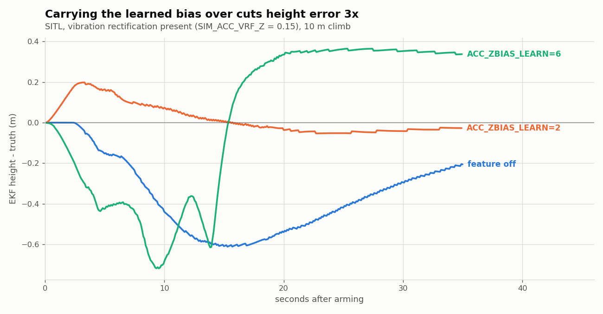
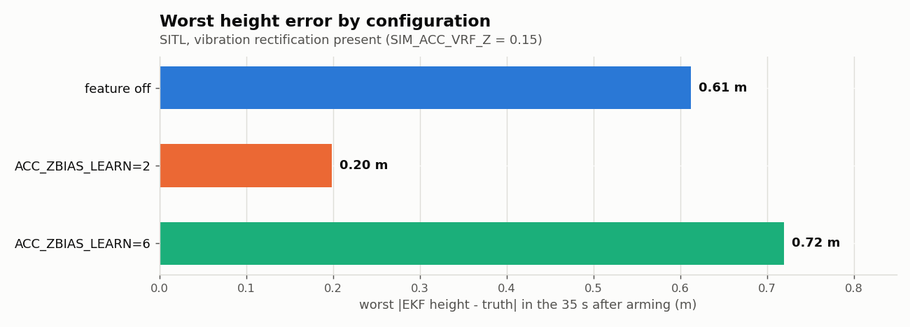
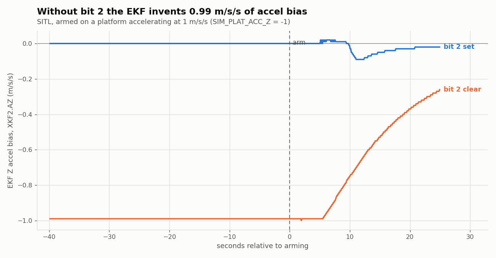

# PR #32471 - hover Z-bias learning for vibration rectification (EKF3 / Copter)

Analysis archive for [ArduPilot/ardupilot#32471](https://github.com/ArduPilot/ardupilot/pull/32471).
Branch `pr-vrf-core` (andyp1per fork), base `master`, approved. Real-flight
numbers inline; no real-flight logs committed. SITL A/B logs and plots added
2026-09-04. Partial: the fleet-wide VRFB history (the frozen-correction /
ground-effect conflict) is not yet here.

> **Read this before changing the code.** Three changes that look obviously right
> from reading the source alone have been measured here and are worse. They are
> listed under "Measured and rejected" below. A 2026-09-04 review pass reasoned
> its way into two of them from the code and had to be reverted; the PR body now
> carries the same list so a reviewer meets it without finding this file.

## Status (one line)

Approved. This records how the vibration rectification bias was measured
independently on two airframes, the one way the learning was seen to go wrong
(a drifting height reference during the learning hover), and - since
2026-09-04 - the first SITL measurement of what the feature is actually worth,
which needed two new simulator capabilities to exist at all.

## The problem

Vibration rectifies into a DC offset on AccZ when motors run. Without a
vertical velocity source (indoor, no GPS) the EKF integrates it into
altitude drift. No stationary calibration can see it: AP_TempCalibration
learns only with !armed && is_still. The PR learns the bias in stable hover
and applies it as a frozen correction from the next boot (`INS_ACC_VRFB_Z`).

## Key findings

### Measuring the bias independently

Indoor 5-inch quad, log197 (not committed): raw IMU AccZ with motors at idle
(VibeZ ~0.2 m/s^2) against a 50 s hover (VibeZ ~3.2), regressed on IMU
temperature to separate the constant term from thermal drift: VRF
+0.089 m/s^2, thermal coefficient -0.045 m/s^2/C, R^2 0.82. An 18 s hover
(log198) gave +0.048. Positive VRF makes AccZ less negative, the EKF reads
it as downward acceleration, and altitude drifts down. Best estimate +0.09,
a useful pre-load for `INS_ACC_VRFB_Z` and a check on what the learning
converges to.

A 5-inch baro-only indoor quad (not committed): near-level quiet hover
against motors-off at matched temperature (33.3 vs 32.1 C), AccZ -9.8298 vs
-9.9190, a +0.089 m/s^2 shift. Same number on a different airframe.

### The learning is only as good as its height reference

On log198 the learned value converged to -0.066, the wrong sign. The DPS310
cooled 8.5 C in 54 s of hover from prop airflow, drifting the baro
~0.015 m/s (~0.6 m), and an upside-down thermal calibration was adding
+0.359 m/s^2 on top of the +0.089 real bias; the EKF absorbed 69% of the
total into its Z bias (-0.510 -> -0.201). The learner is not gated on the
barometer being trustworthy: it samples in a hover where the EKF Z bias
absorbs whatever the vertical channel cannot explain. On the baro-only quad
the `TCAL_BARO_EXP` correction alone moved the baro +0.41 to +0.66 m per
flight as the board prop-cooled (a ramp, the shape a bias state tracks
worst), so a VRFB learned there freezes a thermal artefact into every later
flight (mechanism only; that vehicle had learning off). Learn only against a
reference that does not drift over the learning window - a rangefinder, or
a baro with the thermal error removed - and zero the stored value after any
change to the IMU calibration so it re-learns. The order applied in the
field was baro TCAL off first, then re-learn.

### INS_ACC_VRFB_Z stores the total hover Z bias, not the on/off difference

`Attitude.cpp` writes totalBias = currentBiasZ + frozenCorrection, in the
EKF's sign convention. On the baro-only quad the stored value was -0.083
with a measured hover total of -0.023, and `XKF2.AZ` sat at +0.04 to +0.05
in flight making up the difference. The pair lands about right; neither
number is the rectification offset on its own. The parameter description
("bias learned during hover to compensate for vibration rectification")
will be read as the difference. Say "total".

### Range against clamp (fixed 2026-09-04)

The parameter range was +/-0.5, the EKF clamp `MAX_HOVER_BIAS_CORRECTION` 0.6,
and a true value of ~0.57 was measured on one airframe (the reason the clamp
was raised from 0.3). A fourth number, +/-0.3, survived in the `AP_NavEKF3.h`
comment from before that change. Now one named constant `HOVER_Z_BIAS_LIM` at
0.6, with `@Range` and the comment agreeing. The description gap above
("say total") is fixed in the same pass.

## Measured in SITL, 2026-09-04

Neither half of this could be simulated before. `SIM_ACCn_BIAS` is present at
rest, so it is the one case where the correction can only double-count; the
motor vibration in `SIM_VIB_MOT_MAX` is a zero-mean sinusoid and nothing in the
SITL accel path clips it, so no rectification comes out of it either. The PR's
own autotest used `SIM_ACC1_BIAS_Z` and passed with the correction entirely
absent. Two additions fix that:

- `SIM_ACC_VRF` - a motors-on-only accel offset. With `SIM_ACC_VRF_Z = 0.15`,
  IMU0 `AccZ` reads -9.8174 disarmed and -9.6686 in hover, a +0.149 m/s^2 shift
  the EKF then learns as `XKF2.AZ` +0.114.
- `SIM_PLAT_ACC` - the acceleration felt by a vehicle resting on a moving
  platform, applied while on the ground only. It has to go in the sensor model,
  not the physics: `Aircraft::smooth_sensors()` drives reported acceleration
  towards what the vehicle's own trajectory implies and cancels an offset
  injected into `accel_body` within its 0.1 s time constant.

### The feature is worth about 3x, against the mechanism it is named for





Worst |EKF height - truth| over the 35 s after arming, 10 m climb, correct
value preloaded. Two runs each where shown:

| `ACC_ZBIAS_LEARN` | height error | `XKF2.AZ` range |
|---|---|---|
| 0 (off) | 0.609 / 0.612 m | 0.10 |
| 2 (use) | **0.196 / 0.195 m** | 0.01 |
| 3 (learn+use) | 0.193 m | 0.00 |
| 6 (use+inhibit) | 0.713 / 0.476 m | 0.46 |
| 7 (all bits) | 0.711 / 0.476 m | 0.47 |

`=2` and `=3` are indistinguishable, so the 0.196 m is the price of *applying*
the correction, not of learning it. `=6` and `=7` are also indistinguishable,
so the extra 0.5 m is bit 2 alone - learning first and then pinning does not
avoid it.

Measured against a static bias instead the same feature *costs* 0.64 m against
0.036 m with it off. Both numbers are real and they measure different
mechanisms; a test that injects a static bias measures only the harm.

### Bit 2 is about moving platforms, not the motors-off bias



`updateMovementCheck()` compares `|accel| - GRAVITY_MSS` against `accel_limit`
1.0 - a **magnitude**, so direction is invisible - and the rate-of-change terms
are zero for a steady acceleration. With `SIM_PLAT_ACC_Z = -1.0` and 60 s
disarmed, `onGroundNotMoving` stayed true for 100% of the period:

| | `XKF2.AZ` at arm | height error | climb (10 m demanded) |
|---|---|---|---|
| bit 2 clear | **-0.9900** | 4.479 m | 10.44 |
| bit 2 set | +0.0000 | 1.632 m | 9.67 |

-0.99 m/s^2 of invented bias, 10% of g, carried into a flight where the
platform is gone.

Upstream already intends to cover this - `AP_NavEKF3_core.cpp:1187`
(`is_bias_observable`, "on ground and moving (e.g. carried or on a boat)")
is untouched by this PR and fires correctly once the movement check can see
the acceleration: at `EK3_OGNM_TEST_SF = 0.5` the platform run learns +0.0000
with bit 2 clear.

But the threshold cannot be tuned to do both. From `logm2_log4` (real flight,
not committed), 514 pre-arm XKFM samples, counting those able to latch
`onGroundNotMoving`: 0/514 at SF 0.5, 0/514 at 1.0, 11/514 at 1.25, 14/514 at
the default 2.0. Detecting 1 m/s^2 needs SF < 1.0. The binding term is not the
accelerometer (`ALR` peaked at 0.012) but `GDR`, the gyro rate-of-change metric
- median 0.777, p90 1.055, max 1.398. And a threshold too low to latch switches
off the synthetic zero-velocity fusion entirely, which is what learns the gyro
bias before flight, where bit 2 gates only states 13-15. **Bit 2 is the
surgical instrument; `OGNM_TEST_SF` is the blunt one.** Its description now
says so.

### Measured and rejected

Three changes a code-only reading suggests, each measured worse. Do not
reintroduce any of them without redoing the A/B in `data/ab-2026-09-04/`.

| Change | Argument for it | Measured |
|---|---|---|
| Route the four covariance gates off `accelBiasLearningInhibited()` onto `inhibitDelVelBiasStates` (`cb5026417f`) | `ConstrainVariances` zeroes the accel-bias cross-covariances that `Kfusion` reads, so learning cannot restart after the inhibit clears | `=6` **0.713/0.476 m** with it, **0.448 m** without; `XKF2.AZ` range 0.46 vs 0.01 |
| Freeze P during the inhibit instead (withhold only the process noise) | avoids both the collapse and the inflation | **0.905/0.882 m**, oscillation intact - worse than either |
| Store the motors-on delta in `INS_ACC_VRFB_Z` instead of the total | the static bias is otherwise applied twice at arm | the stored value is a total across the whole fleet; changing it silently reinterprets every one. The arm-time double count is real and belongs to bit 2: `XKF2.AZ` at arm +0.130 clear vs 0.000 set |

`logjk4`'s proposal to gate the frozen correction on ground effect is also
measured worse - 0.644/0.656 m becomes 0.760 m - and targets the
never-leaves-ground-effect regime, a different case. Lowering
`EK3_OGNM_TEST_SF` instead of using bit 2 does not work either: 0/514 pre-arm
samples can latch below SF 1.25, and the binding term is `GDR` (median 0.777,
p90 1.055) not the accelerometer (`ALR` peak 0.012).

**`cb5026417f` still exists on `pr-acro-bias-inhibit` (#32473)** as
`361da5d064`, with a commit message that argues the collapse mechanism
convincingly. If #32473 merges after this PR the measured-worse behaviour
returns. See `../32473/README.md`.

#### The detail on cb5026417f

It routed four `CovariancePrediction` gates off `accelBiasLearningInhibited()`
so the accel-bias covariance stays alive while bit 2 holds the inhibit. Written
against the SITL subtest; no hardware evidence for the collapse it fixes. The
cost is that P[15][15] inflates across the whole disarmed period and the state
is released at arm into the takeoff transient: `=6` goes 0.713/0.476 m with it
to **0.448 m** reverted, and the `XKF2.AZ` range 0.46 -> 0.01. `=2` is
unchanged at 0.196 either way, confirming the revert is a no-op whenever the
vehicle flag is clear. Withholding only the process noise (freezing P rather
than letting it collapse) is worse still at 0.905/0.882 m with the oscillation
intact, so the instability is in the zeroing and reset gates.

Second arm, 2026-09-04: applying the change also fails the shipped
`AccelBiasMovingPlatform` autotest at 3.9 m against its 2.5 m gate, where the
branch as shipped passes at 1.632 m. The VRF and platform arms agree, and a
plain `test.Copter.AccelBiasMovingPlatform` run catches it without the harness.

### Still open

Bit 2 costs 0.448 m against `=2`'s 0.196 m even with `cb5026417f` gone. It
protects the arm-time state and degrades the correction it is protecting.

## What is here

```
32471/
  README.md                       <- this file
  plots/
    make_plots.py                 regenerates all three from data/
    ab_vrf_height_error.png       height error vs time, 3 configs
    ab_platform_accel_bias.png    XKF2.AZ across arming, bit 2 clear vs set
    ab_summary_worst_error.png    worst height error by config
  data/ab-2026-09-04/
    vrf_off.BIN                   ACC_ZBIAS_LEARN=0, SIM_ACC_VRF_Z=0.15
    vrf_use.BIN                   ACC_ZBIAS_LEARN=2, same
    vrf_use_inhibit.BIN           ACC_ZBIAS_LEARN=6, same
    plat_bit2_clear.BIN           ACC_ZBIAS_LEARN=0, SIM_PLAT_ACC_Z=-1.0
    plat_bit2_set.BIN             ACC_ZBIAS_LEARN=4, same
    harness.py                    the throwaway autotest methods used
```

SITL logs only. Real-flight numbers are quoted inline; those logs are not
committed.

## Reproduce

```
git checkout pr-vrf-core
./waf configure --board sitl && ./waf copter
Tools/autotest/autotest.py --no-configure test.Copter.VibrationRectificationBiasLearning
```

`VibrationRectificationBiasLearning` was rewritten 2026-09-04 to use
`SIM_ACC_VRF_Z` and to assert the height improvement via
`assert_ekfs_match_sim_state(max_pos_d_err_m=0.35)`; verified to fail when the
correction is disabled, which the previous version did not.
`AccelBiasMovingPlatform` is new and asserts the bias stays near zero on an
accelerating platform; verified to fail with bit 2 neutered.

To regenerate the plots:

```
cd 32471/plots && python3 make_plots.py
```

A negative test for the wrong-sign case would add `SIM_BARO_DRIFT` during
the learning hover and assert the stored bias is not accepted; it does not
exist yet. The thermal contamination itself has no SITL model (the SITL
baro has no temperature term).

## Review pass, 2026-09-04

Landed on top of the measured work above, after a `/pr-review` of the stack:

- The vehicle's accel-bias learning inhibit now reaches Replay. It was a plain
  frontend bool, so a replayed acro segment learned bias the aircraft did not.
  Added a DAL event pair following `setTerrainHgtStable`, plus the Replay
  dispatch - an event rather than an RFRN bit because the flags byte is full.
- The frozen correction is read from the DAL at the point of use rather than
  pushed in from the vehicle. Only the boot-time load was DAL-visible before, so
  a second arm in the same boot replayed with the wrong correction - which
  `logtc5_2` flew. Landed as a three-commit forwarder dance because the removal
  crosses AP_NavEKF3/AP_AHRS/Copter.
- `INS_ACC*_VRFB_Z` is now `#if APM_BUILD_COPTER_OR_HELI`. The `{Copter}` tag was
  documentation only, so the parameter shipped on Plane, Rover, Sub and Blimp as
  a dead settable knob. Verified: the string is in `arducopter`, absent from
  `arduplane`.
- The parameter is written once on disarm instead of every 100 Hz learning step.
  It made RISJ a per-frame replay message for nothing; EKF3 reads it once.
- `AccelBiasMovingPlatform` grew the positive control this file's own numbers
  imply - it now measures -0.990 m/s/s with bit 2 clear before asserting 0.000
  with it set, so a broken stimulus fails instead of passing.
- The four AHRS accessors no longer gate on `active_EKF_type()`, which could
  swallow a one-shot write during a transient EKF3 fault.

Two changes from that pass were reverted after reading this file: see "Measured
and rejected".

## Branches and people

- `pr-vrf-core` - the PR branch, `6fa6c26abb` as of 2026-09-04. Depends on #32396.
- Author: @andyp1per. Approved, then reworked by the 2026-09-04 review pass.
- Distinct from #34209 (XY bias in unaided flight) and #32473 (acro
  inhibit), which still carries `cb5026417f`.
