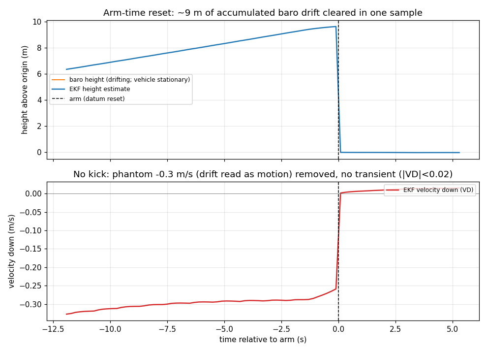
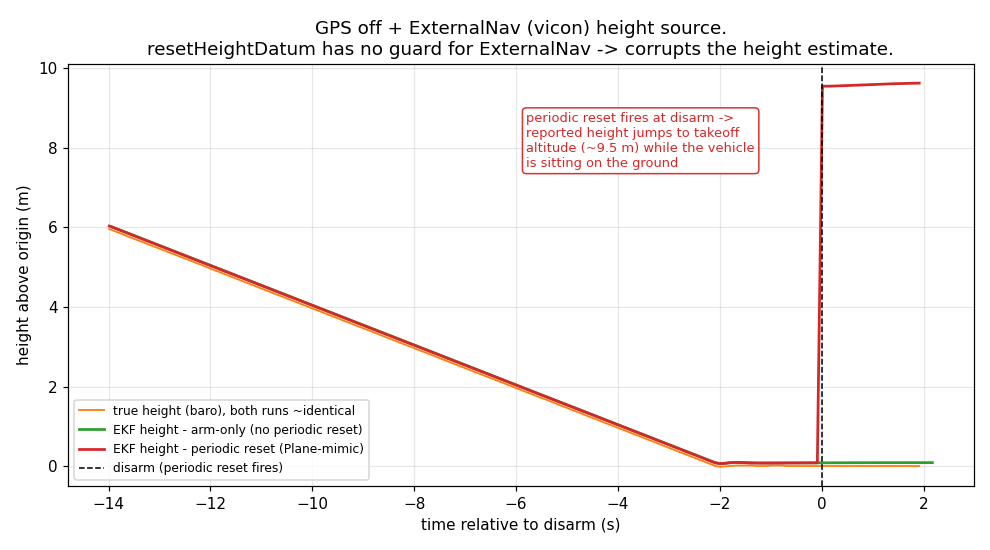
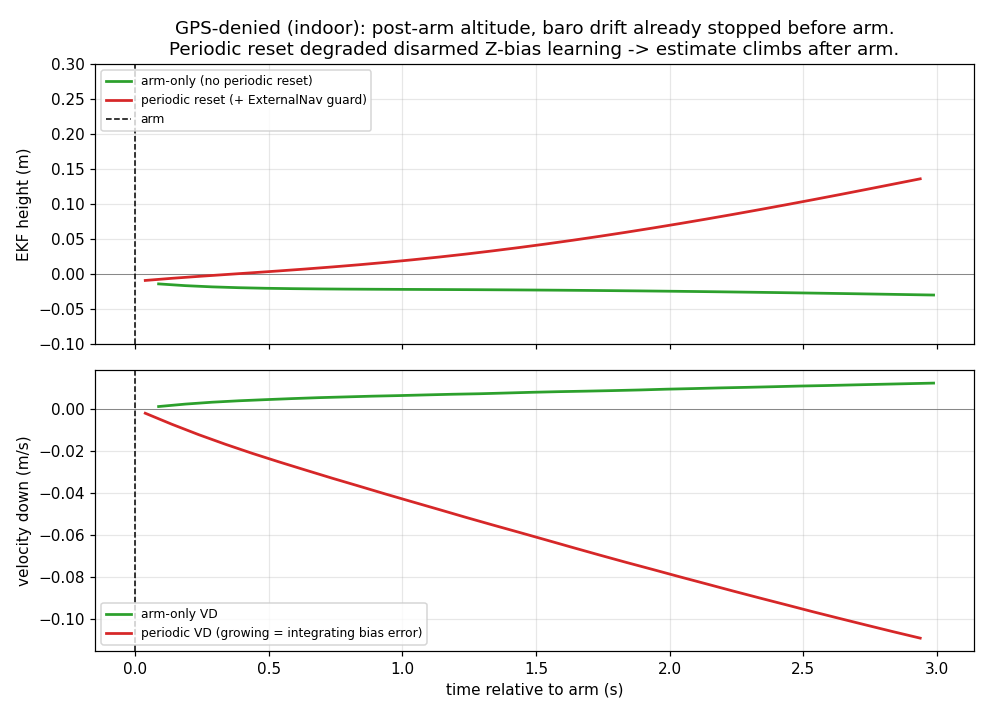
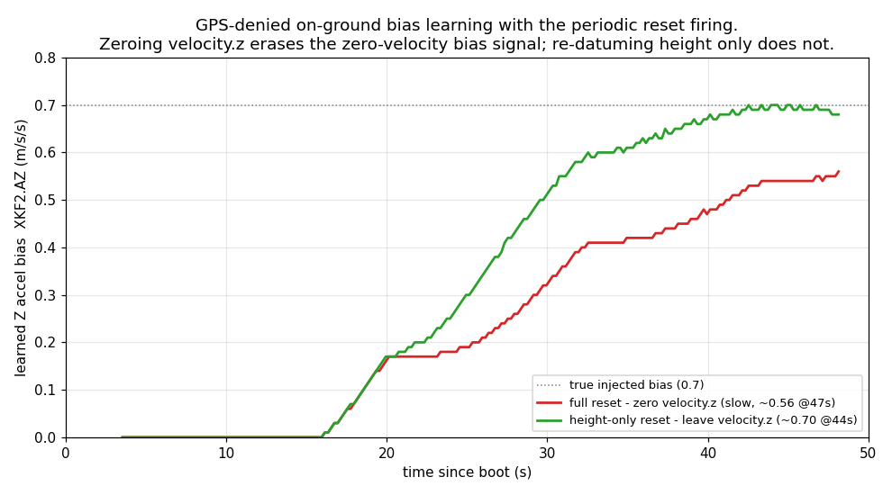
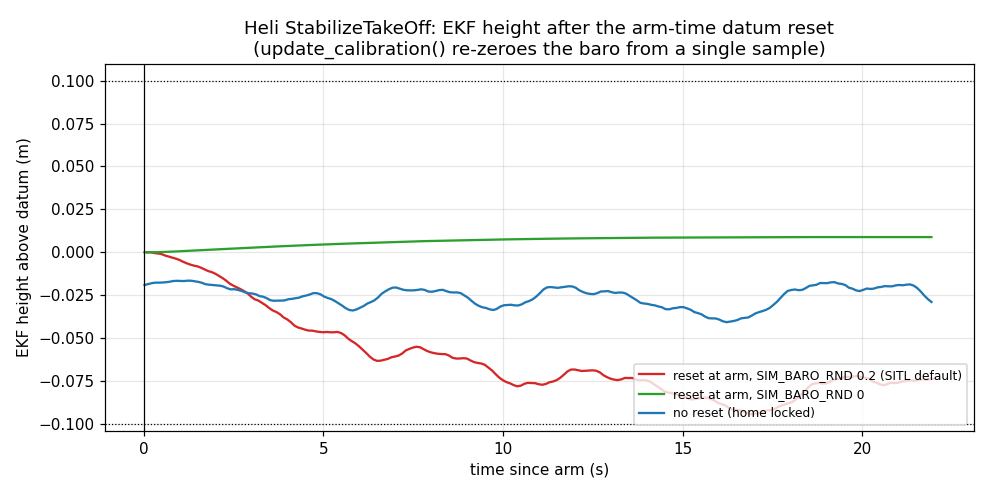

# PR #32768 - Clear baro temperature drift on arming (ArduCopter / EKF3)

Analysis archive for [ArduPilot/ardupilot#32768](https://github.com/ArduPilot/ardupilot/pull/32768).
Everything here is from SITL (no real-flight data).

## Status (one line)

Shipped design is **reset the EKF height datum once, at arm**. The reviewer
suggestion to *also* reset periodically while disarmed (like Plane) was
implemented, tested, found to cause regressions, and removed. A height-only
variant of the periodic idea is preserved as a separate experiment, PR
[#33338](https://github.com/ArduPilot/ardupilot/pull/33338) (see `../33338/`).

**2026-08-29:** self-reviewed and cut back to 11 commits. The origin-vs-GPS
tolerance gate (`HGT_RESET_ALT`, the Plane `HOME_RESET_ALT` changes, the
`RHGT`/`RHG2` replay messages) turned out to be redundant and was removed;
Plane vehicle code is back at master; an EKF3 frontend inconsistency in the
reported origin height was found and fixed; the heli test relaxation got its
real mechanism. See `self-review-2026-08-29.md`.

## The problem

The barometer drifts with temperature while a copter sits disarmed, so the
reported height wanders off - metres by takeoff. The PR re-zeroes the height
reference at arm, just before flight, so the altitude is correct when it starts
being used.

## The conclusion and why

Arm-only is the right scope for Copter. `resetHeightDatum` is only valid on the
ground, with baro/GPS height, at a moment you are about to use the estimate -
arm satisfies all three. Running it repeatedly while disarmed fires it in states
it was never designed for, and that is where every problem came from.

The periodic reset, in the forms tried, caused:

1. **Height corruption with a non-baro height source** (GPSViconSwitching). The
   reset had no guard for ExternalNav/vicon; firing it there snapped reported
   height to the takeoff altitude on the ground. Plot B.
2. **Degraded GPS-denied takeoff estimate** (BaroDriftClearedAtArm, GPS-denied).
   The reset zeroes `velocity.z`, which on the ground is how the EKF learns its
   Z accel bias (zero-velocity fusion); repeatedly erasing it leaves a worse
   bias at arm that integrates into a post-arm altitude climb. Plots C and D.
3. **Disarmed replay-logging stress** (Replay) - CI-only evidence.
4. It only avoided slowing from-boot bias learning via a convergence gate +
   non-Plane interval, i.e. load-bearing complexity arm-only does not need.

Plane needs no change: it clears drift at arm (works baro-only) and gates its
periodic reset on a GPS fix, which confines it to the regime where it is
harmless. Details in `analysis.md`.

## Key finding: it is the velocity reset, not the datum

Paul Riseborough's review point - a datum reset should redefine the zero-point
without touching vertical velocity - is the crux. A one-variable A/B (Plot D)
confirms it: with the periodic reset firing during GPS-denied bias learning,
zeroing `velocity.z` plateaus the learned bias at ~0.56, while re-datuming
height only reaches the true 0.70. The height/baro re-datum is innocent;
`resetHeightDatum` does not touch the covariance.

That motivated #33338 (a `reset_velocity` flag: periodic = height-only, arm =
full). It fixes findings 1 and 2 and drops the gate - but `RudderDisarmMidair`
still fails on the periodic reset regardless of velocity handling (arm-only
3/3 pass; both periodic variants 3/3 fail), so arm-only remains the
recommendation. See `../33338/`.

## Second key finding (2026-08-29): the reset needs no tolerance gate

`getPosD()` reports `position.z + (public_origin.alt - ekfGpsRefHgt)`. The
full reset zeroes `position.z` and re-anchors `ekfGpsRefHgt` to GPS, so with
GPS the reported height already drops the drift and keeps a real elevation
change; the Kalaupapa re-arm test gives identical numbers with and without
the gate (AMSL 76.3 m, XKF1.PD 89.07 m). Removing it exposed that
`NavEKF3::getOriginLLH()` reported the core's corrected reference height
whenever `common_origin_valid` had been cleared by a filter re-init (an
origin set before the filter starts), which left the reported origin, posD
and AMSL inconsistent by the reference shift: FarOrigin climbed without
bound. The frontend now always reports the public origin height. The heli
`StabilizeTakeOff` offset (0.08-0.12 m) is `AP_Baro::update_calibration()`
re-zeroing from a single noisy sample, not rotor wash (Plot E).

## Plots

| | |
|---|---|
|  | **A** - arm-time reset clears ~9 m drift in one sample; removes the phantom -0.3 m/s, no kick |
|  | **B** - periodic reset corrupts height (jumps to ~9.5 m) with vicon as the height source; arm-only stays at 0 |
|  | **C** - GPS-denied: periodic post-arm altitude climbs; arm-only stays flat |
|  | **D** - zeroing velocity.z (red) interrupts bias learning; height-only (green) reaches the true bias |
|  | **E** - heli post-arm height: the reset re-zeroes the baro from one noisy sample (red); with zero baro noise (green) or no reset (blue) it stays at 0 |

## What is here

```
32768/
  README.md          <- this file
  analysis.md        <- full write-up (posted as the PR #32768 analysis comment)
  design-notes.md    <- earlier design notes on the (since removed) periodic reset
  self-review-2026-08-29.md <- review findings, gate removal, origin-height fix, heli mechanism
  plots/             <- A/B/C/D/E PNGs + make_plots.py (regenerates them from data/)
  data/
    arm-only/        <- SITL BINs from the arm-only build (this PR's design)
      barodrift_arm.BIN     (Plots A, C)
      gpsvicon_clean.BIN    (Plot B, clean trace)
    periodic/        <- SITL BINs from the periodic-reset build(s)
      gpsvicon_FAIL.BIN     (Plot B, corrupted trace)
      guard_barodrift.BIN   (Plot C, periodic+guard GPS-denied)
      fullreset_bias.BIN    (Plot D, zero velocity.z)
      heightonly_bias.BIN   (Plot D, leave velocity.z)
    heli/            <- SITL heli BINs from the final series (Plot E)
      reset_baro_rnd_0p2.BIN    (reset at arm, SITL default baro noise)
      reset_baro_rnd_0.BIN      (reset at arm, SIM_BARO_RND 0)
      no_reset_home_locked.BIN  (home locked, so no reset)
```

All BINs are SITL (ArduCopter V4.8.0-dev, CMAC default home; each carries
hundreds of `SIM_*` parameters).

## Reproduce

Plots, from this directory:

```
python3 plots/make_plots.py
```

The SITL behaviours, in an ardupilot checkout:

```
# arm-only branch (this PR, 11 commits at 320f53ce01) - these pass:
git checkout pr-baro-drift-minimum
./waf configure --board sitl && ./waf copter
Tools/autotest/autotest.py --no-configure test.Copter.BaroDriftClearedAtArm,AmslAltPreservedOnRearmAtDifferentElevation,FarOrigin
Tools/autotest/autotest.py --no-configure test.Copter.GPSViconSwitching

# periodic-reset branch - reproduces the problems (run GPSViconSwitching a few times):
git checkout pr-baro-drift-minimum-periodic-reset
./waf copter
Tools/autotest/autotest.py --no-configure test.Copter.RudderDisarmMidair   # fails on periodic
```

## Branches and people

- `pr-baro-drift-minimum` - the PR #32768 branch (arm-only). Rewritten to the
  11-commit series on 2026-08-29; the PR on GitHub shows the old 37 commits
  until it is force-pushed.
- `pr-baro-drift-minimum-periodic-reset` - PR #33338 (height-only periodic experiment).
- Reviewers: @tridge (suggested mimicking Plane's periodic reset), @rmackay9,
  Paul Riseborough (EKF author; "less is more", datum reset should not touch
  velocity/covariance - which the velocity-reset finding confirms).
