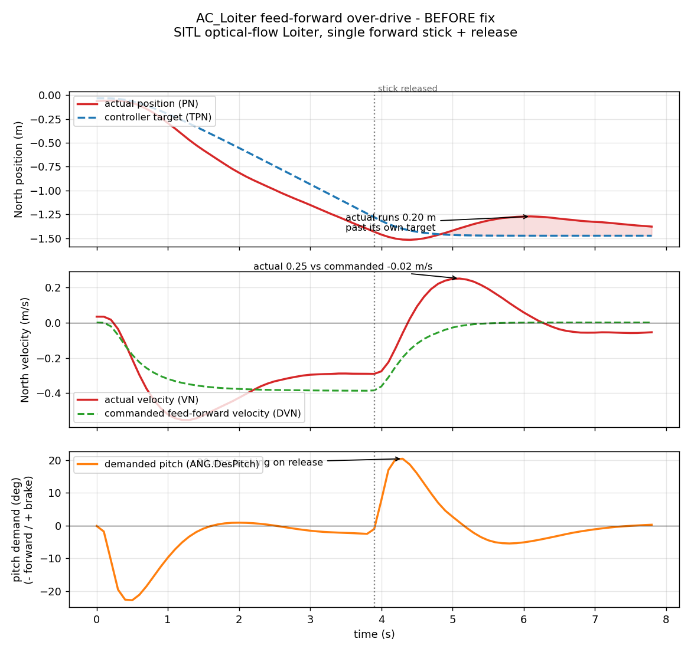
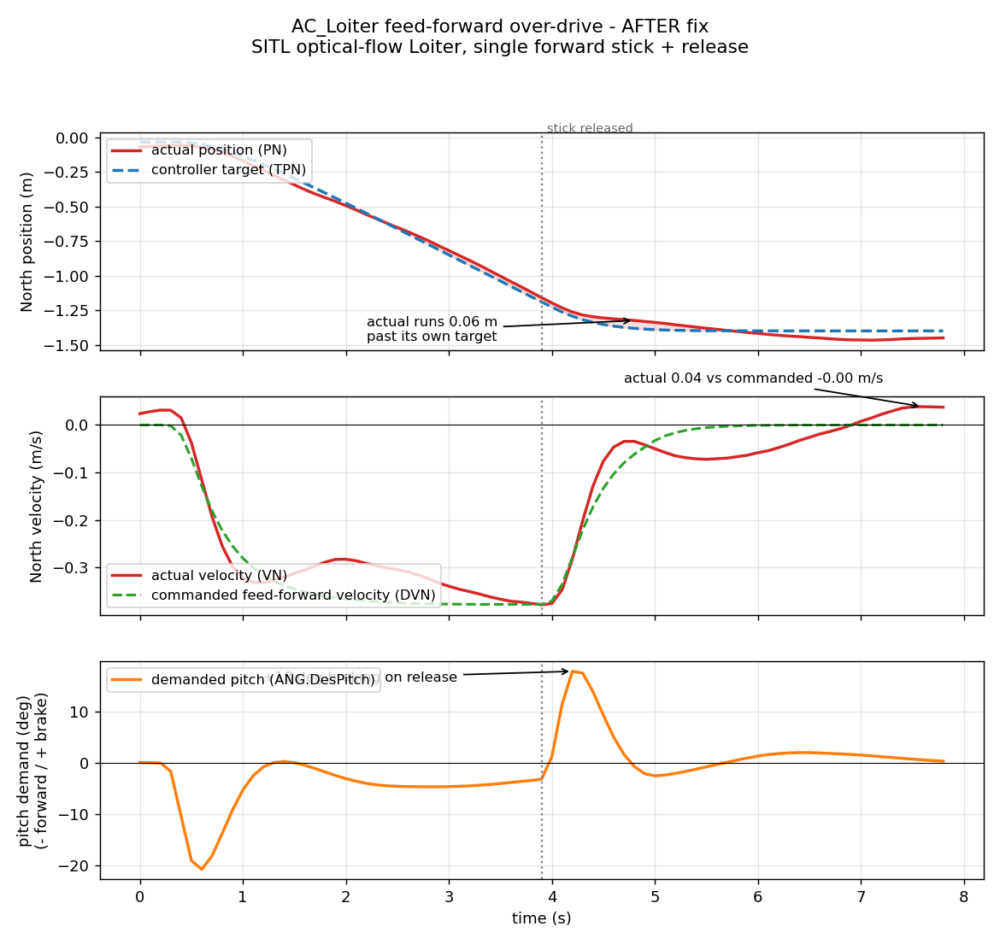

# PR #33318 - AC_Loiter drag/feed-forward consistency fix

Analysis archive for [ArduPilot/ardupilot#33318](https://github.com/ArduPilot/ardupilot/pull/33318).
Branch `pr-loiter-brake-drag` (author andyp1per). Committed plots/data here are
from SITL; the real-flight forensic numbers (logs 276/278) are cited inline only,
no real-flight logs are committed to this public repo.

## Status (one line)

One-line kinematic-consistency fix in `AC_Loiter::calc_desired_velocity`.
SITL-validated, confirmed on the vehicle across three indoor optical-flow flights
(log276 before, log278/log279 after), and forensically cross-checked against the
reviewer's root-cause analysis - the two agree on the mechanism and the fix takes
load off the velocity-PID integrator in the regime where the bug lives. log279
also makes the case for the reviewer's larger follow-up fix (see below).

## The problem

In Loiter, `calc_desired_velocity` shapes the desired velocity toward the speed
limit with a "drag" deceleration. That drag is subtracted from the desired
velocity, but only the *braking* term was subtracted from the acceleration
feed-forward handed to the position controller - the drag was left in. So the
`(velocity, acceleration)` pair was not kinematically consistent: the
feed-forward over-drove the vehicle past its own speed-limited desired velocity,
built a position error, and the position loop then corrected it abruptly. A
forward stick produced a backward lurch on release.

The error scales with the drag term, `pilot_accel_max * speed / gnd_speed_limit`.
It is pronounced on optical-flow Loiter at low height - the EKF collapses
`gnd_speed_limit` to `(FLOW_MAX-1) * HAGL` (sub-metre/s near the ground), so the
drag term balloons - and negligible with GPS, where the speed limit is high.

## The fix

Subtract the drag from the feed-forward as well, so it equals `d(desired_vel)/dt`:

```cpp
// libraries/AC_WPNav/AC_Loiter.cpp, calc_desired_velocity()
loiter_accel_decel_mss = desired_vel_norm * (_brake_accel_mss + drag_decel_mss); // was: * _brake_accel_mss
...
_desired_accel_ne_mss -= loiter_accel_decel_mss; // now removes drag + brake, not just brake
```

The braking term was already removed from both paths; the drag was only removed
from the desired velocity. This makes the two paths consistent. The drag *model*
is untouched.

## The conclusion and why

This is the right narrow fix for the overshoot. It does not change the drag
model, it changes only whether the drag term is consistent between the velocity
it shapes and the acceleration it feeds forward. The reviewer (Leonard) and this
analysis agree the deeper issue is the drag formula treating the EKF
observability cap as a terminal velocity; that is a larger behaviour change
(scale `pilot_acceleration_max` and `gnd_speed_limit` down together) and belongs
as its own piece. See `analysis.md` for the forensic exchange.

## Key finding: the fix removes integrator abuse, it does not hide behind it

The review raised a fair concern: that the patch "works because the velocity
PID's I-term absorbs the mismatch" and so papers over the real bug. Following the
same steady-state relation through both regimes shows the opposite in the regime
that matters. Real-flight logs (log276 before, log278 after, same airframe and
params):

| velocity-PID integrator | pre-fix | post-fix |
|---|---|---|
| GPS, calibrated cap | `real_drag - drag ~ 0` | `real_drag` (small load added) |
| flow, collapsed cap | `real_drag - drag` = `-drag` (large) | `real_drag ~ 0` (small) |

The bug and the logs live in the flow/collapsed row. There the *old* code leaned
on the integrator (it had to wind to ~`-drag` to track, and lagged in
transients - the overshoot). Measured: integrator magnitude P95 2.9 m/s^2 (peak
3.7) before, 0.16 (peak 0.19) after; along-track position error +/-0.9 m -> +/-0.1 m.
The concern is real but applies to the GPS/calibrated row, where the added load
is tiny.

## Follow-up: log279 - the fix holds, and exposes the drag magnitude

A third indoor flight (log279, same airframe, fix in firmware fea9ea77) was flown
with a deliberate "twitch in the middle" to probe it. 175 s of optical-flow Loiter,
HAGL mean 0.39 m, cap collapsed throughout. The fix confirms again: velocity-PID
integrator P95 0.18 m/s^2 (peak 0.23), along-track position error P95 0.059 m
(peak 0.10), and through a burst of 8 rapid forward jabs the position held within
+/-0.07 m with no overshoot and no backward lurch (over-drive ~1.2x).

The "twitch" is not the old bug and not a spontaneous event - every lean spike
>10 deg followed stick activity within the preceding second. It is the braking
response to that 8-jab burst: on each release the controller commands a sharp
rearward lean of 15-19 deg. That lean is the drag deceleration, now correctly in
the feed-forward, braking cleanly to a stop (hence the tiny position error). What
makes it read as a twitch is magnitude, not direction: `drag_decel` reaches
~5 m/s^2 (0.92 of pilot_acc_max) to arrest a <0.86 m/s velocity, because
`gnd_speed_limit` is the collapsed EKF flow cap (0.5-2.5 m/s here). The brake is
kinematically correct but absurdly aggressive.

Two things make it worse at this height, both worth raising upstream:

- The rangefinder is dropping out at its minimum range. `RFND.Status` shows value
  2 (OutOfRangeLow) and `Dist` floors at 0 with a max of 1.02 m, while the EKF
  `HAGL` drifts to 1.7 m. So `HAGL` swings 0.3-1.7 m, the cap swings 0.5-2.5 m/s,
  and the drag magnitude (hence the brake lean) jumps from jab to jab.
- The fix routes drag into the feed-forward, so this inflated, cap-noise-modulated
  drag is now directly visible as attitude rather than being filtered through the
  desired-velocity / position loop.

This is the cleanest evidence for both halves of the review: the consistency fix is
correct and removes the overshoot, and it inherits the inflated drag magnitude the
reviewer flagged (cap treated as terminal velocity). It supports shipping the fix
and pursuing his scaling follow-up (pull `pilot_acceleration_max` down with the
cap), plus a separate look at the rangefinder min-range dropout corrupting the cap
below ~1 m. log279 is a real flight and is not committed here; numbers only.

## Plots

All SITL (`LoiterFlowBrakeOvershoot` autotest: optical flow, no GPS, ~2 m height,
`LOIT_ANG_MAX=30`, deterministic forward jab + release).

| | |
|---|---|
|  | **A** - before: feed-forward over-drives actual velocity past the commanded trajectory; actual position runs ahead of target; braking lurch on release |
|  | **B** - after: feed-forward tracks the desired velocity, position holds near target, no backward lurch |

## What is here

```
33318/
  README.md          <- this file
  analysis.md        <- forensic write-up (the PR comment to the reviewer)
  forensic_drag_analysis.py  <- reusable: reconstructs drag_decel + vel-PID I-term from a log
  plots/             <- A/B before/after PNGs + make_plots.py (regenerates from data/)
  data/
    before.BIN       <- SITL LoiterFlowBrakeOvershoot, drag left in feed-forward
    after.BIN        <- SITL LoiterFlowBrakeOvershoot, with the fix
```

All BINs are SITL (ArduCopter 4.7-beta, CMAC default home, hundreds of `SIM_*`).

## Reproduce

Plots, from this directory:

```
python3 plots/make_plots.py
```

The SITL behaviour, in an ardupilot checkout on the PR branch:

```
./waf configure --board sitl && ./waf copter
Tools/autotest/autotest.py --no-configure test.Copter.LoiterFlowBrakeOvershoot
# compare PSCN.PN vs PSCN.TPN and PSCN.VN vs DVN in the forward-jab window
```

To capture the "before" trace, revert the one-line change in
`calc_desired_velocity` (`loiter_accel_decel_mss = desired_vel_norm * _brake_accel_mss`)
and rebuild.

## People

- Author: @andyp1per.
- Reviewer: Leonard Hall (attitude/position-control author) - agreed on the root
  cause, raised the I-term concern (addressed above and in `analysis.md`), and
  proposed the larger drag-model scaling fix as separate future work.
