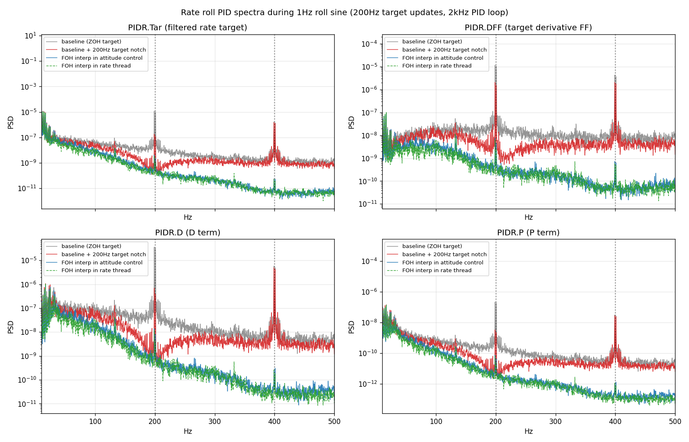
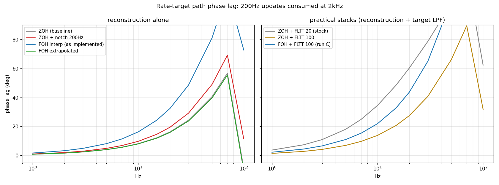

# PR #34208 - Interpolate the rate target in the fast rate thread

Analysis archive for [ArduPilot/ardupilot#34208](https://github.com/ArduPilot/ardupilot/pull/34208).
Branch `pr-rate-target-interp` (andyp1per fork), base `master`. The plots here
are from SITL; the hardware numbers are cited inline only, no real-flight logs
are committed to this public repo.

## Status (one line)

Opened 2026-08-29. Four commits: the interpolation in the copter rate thread,
the RATE.*Des logging fix it exposed, the SITL gyro rate following
INS_GYRO_RATE so the effect can be reproduced in SITL, and a SITLGyroRate
autotest. SITL A/B measured, flown on a 4 inch quad, awaiting review.

## The problem

With the fast rate thread the rate PIDs run at the gyro rate (2-4 kHz) on a
target that only updates at the main loop rate (200-400 Hz), so they consume a
zero-order-hold staircase. The held target's error is sawtooth-like, so its
spectrum is a comb at the update rate and its harmonics, with power falling
only as 1/k^2, sitting on broadband images of the target's own content. The D
and D_FF paths differentiate the steps into impulses, which flattens the comb,
so the un-notched harmonics dominate exactly where shot noise hurts most.

The original complaint was "target notch set, no effect". A PID target notch
(`ATC_RAT_*_NTF`) removes one line of the comb and none of the image floor: in
SITL it took -19 dB off the fundamental and -0.7 dB off the second harmonic.

## The fix

Ramp the target across the fast loop steps instead. `rate_controller_run_dt()`
now takes the target, so the ramp state stays owned by the rate thread and the
main loop path is unchanged; sysid is added downstream so chirps still inject as
steps. The ramp restarts when the target changes (not on the decimation counter,
which drifts against the asynchronous main loop) and resyncs to the live target
after the thread has been idle or the step count has changed.

## SITL A/B (controlled)

200 Hz loop, 2 kHz rate thread, 1 Hz full-stick roll sine in AltHold,
`FLTT=FLTD=100` and `D_FF=0.001` to expose the derivative path.

| roll, sine window, dB | ZOH baseline | ZOH + notch at 200 Hz | ramped target |
|---|---|---|---|
| target line at 200 Hz | -50.4 | -69.0 | -83.7 |
| target line at 400 Hz | -58.3 | -58.7 | -99.7 |
| D term 150-450 Hz | -44.1 | -52.1 | -69.5 |
| D_FF 20-500 Hz | -47.4 | -52.3 | -64.3 |
| RMS rate error, rad/s | 0.129 | 0.128 | 0.118 |

The notch column is the notch working correctly and still not helping: the
400 Hz line is untouched and the floor above ~250 Hz barely moves.

## Latency: why FLTT can go up afterwards

The reconstruction sits in the reference path, so rate-loop stability margins
are untouched; the cost is attitude-loop phase. Simulated with ArduPilot's own
biquad and low-pass coefficients:

| target path | group delay | @5 Hz | @10 Hz | @20 Hz |
|---|---|---|---|---|
| ZOH (baseline hold) | 2.25 ms | 4.1 deg | 8.1 | 16.2 |
| ZOH + notch 200 Hz | 2.70 ms | 4.9 | 9.7 | 19.4 |
| ramp (first-order hold) | 4.50 ms | 8.1 | 16.2 | 32.4 |
| ZOH + FLTT 20 (stock) | 10.0 ms | 18.1 | 34.5 | 60.3 |
| ramp + FLTT 100 | 6.1 ms | 11.0 | 21.9 | 43.6 |
| ramp, extrapolated (not flown) | 2.20 ms | 4.0 | 7.9 | 15.8 |

The ramp costs a flat +2.25 ms over ZOH. Stock `FLTT=20` costs 10 ms on its own
and its whole job was smoothing this staircase, so doing that structurally lets
`FLTT` go up and the flown stack ends up quicker than stock while being 24 dB
quieter.

## Hardware (4 inch quad, 200 Hz loop, 4 kHz gyro, FSTRATE_DIV=2)

Three flights, three builds. Update-rate imaging in the target, normalised by
each flight's own baseband motion and FLTT: -36.0 dB (ZOH, FLTT 30, notch on),
-51.5 dB (ramp, FLTT 60, notch on), -50.9 dB (ramp, FLTT 50, notch off).
Tracking error per unit of commanded motion 0.276 -> 0.153 -> 0.097. Removing
the notch cost nothing measurable. The three flights differ in firmware, FLTT
and notch state at once, so the SITL A/B is the only clean attribution.

What did not change between log95 and log98 is as telling as what did. In
the 150-450 Hz band the target dropped 12-20 dB while the gyro and D-term
spectra stayed put: on this vehicle the D-path noise up there arrives
through the gyro from the motors (fundamental ~210 Hz at 12,650 RPM), which
no target-side filter can touch. The interpolation removes the update-rate
imaging; it does not buy a quieter D term on a vehicle whose D noise is
gyro-borne, and whether FLTD/INS_GYRO_FILTER can then come up is a property
of that airframe's gyro noise floor, not of this change.

Two caveats on log106. It was flown about three times harder than the other
two (target RMS 0.63 vs 0.22 rad/s), which the normalised measures absorb.
And STAT_BOOTCNT and STAT_FLTTIME both reset against log98 (56 -> 8,
1623 -> 113 s) with a bit-identical parameter set, down to the learned
INS_ACC*_VRFB_Z; a reflash with a parameter restore is the likely reason,
but same-airframe continuity is not provable from the log. The imaging
ratio is a property of the firmware and survives that; the tracking
comparison should be read with it in mind.

A predictive (extrapolated) first-order hold recovers the ramp's 2.25 ms on
paper (the extra row in the latency table). It was simulated and not flown:
it trades the delay for overshoot on every target reversal, and the flown
stack is already quicker than stock.

## Three measurement traps

- PIDR is logged at half the rate-thread rate, so with a 2 kHz thread the
  true 800 Hz harmonic folds onto 200 Hz in the log. A notch that is working
  perfectly still shows a line at its own centre frequency. This is why the
  notch looked dead on hardware even where it was doing its job.

- Line prominence does not discriminate on hardware. Measuring the comb as
  "line power vs its own sidebands" works in SITL, where the sidebands are
  empty; on hardware the sidebands are images of a broadband target, so line and
  floor collapse together. Use image-band power relative to the flight's own
  baseband motion, corrected for FLTT.
- `RATE.*Des` was the target for the *next* rate-controller run, read at log
  time, while `RATE.*` is a gyro snapshot taken inside the controller. Once the
  target is interpolated these are different signals and every Des-to-Act tool
  inherits the error (one such tool reported damping falling and 40 Hz output
  activity rising 6x; neither survived direct checking). Fixed by snapshotting
  the applied target with the gyro. `PIDR.Tar` was always correct.
  Verified in SITL from the fact that RATE.RDes is logged pre-FLTT, so a
  held target is bitwise identical between consecutive samples: held
  fraction 80.0% (ramped firmware, old logging), 1.2% (ramped, fixed
  logging), 80.0% (ZOH firmware, fixed logging). The third row is the
  control: the fix reports whatever the PID received, it does not force a
  ramp into the log.

## Tuning consequences

- Remove ATC_RAT_*_NTF once the interpolation is in. It buys nothing
  against a comb and costs 0.45 ms.
- Re-tune FLTT rather than jumping to 100. 50-60 is clean on the flown
  vehicle; the phase table says 80 would buy another ~2 ms if the spectra
  allow it.
- EKF fusion transients (GPS/baro/mag steps, lane switches) live below
  ~25 Hz and pass through in every configuration; no tolerable FLTT touches
  them and the interpolation neither helps nor hurts. That is an EKF-side
  problem.

## Plots

| | |
|---|---|
|  | **A** - SITL rate PID spectra: ZOH, ZOH + notch, ramp in attitude control, ramp in the rate thread. The two ramps land on top of each other; the notch leaves the 400 Hz line and the floor |
|  | **B** - target-path phase lag by reconstruction, and the practical stacks with FLTT |

## What is here

```
34208/
  README.md          <- this file
  plots/
    rate_target_sitl_spectra.png
    rate_target_phase_lag.png
```

No `data/` or `make_plots.py`: the spectra were computed from SITL runs that
were not archived. The setup to redo them is below.

## Reproduce

```
git checkout pr-rate-target-interp
./waf configure --board sitl && ./waf copter
Tools/autotest/autotest.py --no-configure test.Copter.SITLGyroRate           # 1/2/4 kHz
Tools/autotest/autotest.py --no-configure test.Copter.DynamicRpmNotchesRateThread
```

For the A/B: `SCHED_LOOP_RATE=200 FSTRATE_ENABLE=3 FSTRATE_DIV=1 INS_GYRO_RATE=1`
(2 kHz gyro on this branch), `ATC_RAT_RLL_FLTT=100 ATC_RAT_RLL_FLTD=100
ATC_RAT_RLL_D_FF=0.001`, log PIDR at full rate, fly a 1 Hz full-stick roll sine
in AltHold, and compare PSDs of `PIDR.Tar/P/D/DFF` against the parent commit
(ZOH). Use a fixed rate: above `SIM_RATE_HZ` the SITL gyro samples arrive in
bursts, which the dynamic rate mode reads as the thread running slow.

## Branches and people

- `pr-rate-target-interp` - the PR branch.
- Pre-submission review (single-sourced, Claude subagent) found and the branch
  fixed: stale ramp state after the thread idles, a divide-by-zero for
  `INS_GYRO_RATE >= 8` in the SITL backend, an unbounded catch-up loop after a
  gyro fail-mask, burst samples sharing one timestamp, and a heli sysid claim in
  the logging commit that the scheduler order does not support.
