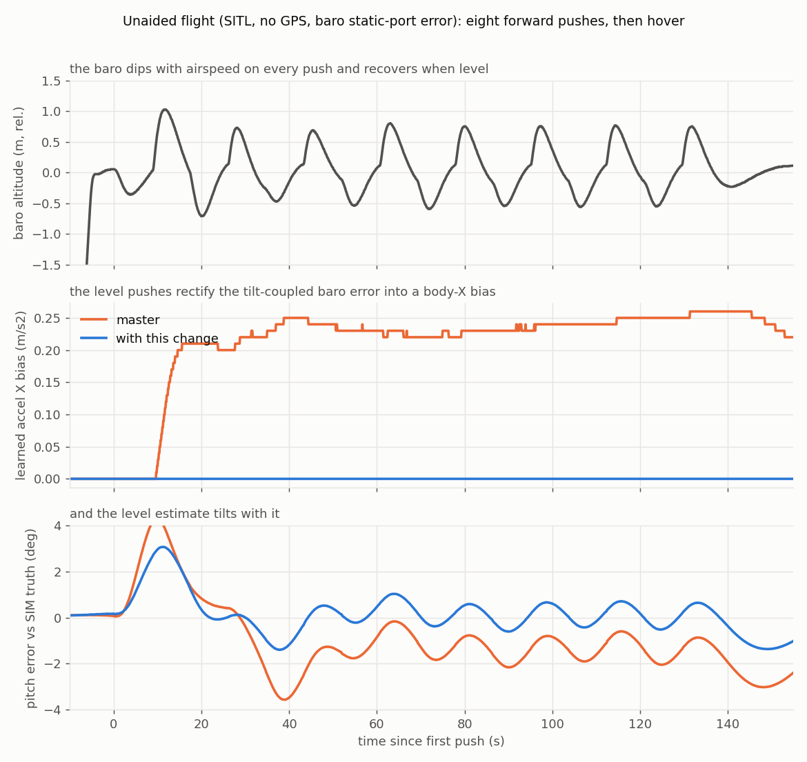

# PR #34209 - Do not learn XY accel bias in unaided flight (EKF3)

Analysis archive for [ArduPilot/ardupilot#34209](https://github.com/ArduPilot/ardupilot/pull/34209).
Branch `pr-ek3-noaid-xy-bias` (andyp1per fork), base `master`. Everything
committed here is from SITL; the real-flight numbers are cited inline only.

## Status (one line)

Opened 2026-08-29. Two commits: the observability change in
`CovariancePrediction` and the `EK3NoAidAccelBiasXY` autotest, which fails on
master and passes with the change. Awaiting review.

## The problem

In AID_NONE (no GPS, no flow, baro only) the synthetic horizontal
position/velocity observations are already barred from updating the accel bias
states in `FuseVelPosNED`, but `CovariancePrediction` still marks all three bias
axes observable in flight, so the XY bias variance is reinstated at takeoff and
grows on process noise. The only observation that then reaches the XY states is
the height innovation coupled in through tilt. A baro static-port dip during a
forward push, fused while pitched, is learned as a body-X bias; levelling off
removes the coupling while the baro recovers, so repeated pushes rectify it into
a one-sided bias and the level estimate tilts by `atan(bias/g)`.

Seen on a small quad flying with no GPS: the X bias walked to -0.4 m/s2 within
30 s of forward flight and the EKF pitch read +2.2 deg on the ground after
landing where it read +0.1 deg before takeoff. `EK3_NOAID_M_NSE`,
`EK3_ABIAS_P_NSE` and `EK3_ACC_BIAS_LIM` do not address it and `EK3_ALT_M_NSE 5`
only halves it, because the coupling is structural, not a noise setting.

## The fix

Only a near-vertical body axis (`|prevTnb[axis][2]| > 0.8`) stays observable in
unaided flight, from the height reference; XY are inhibited until aiding
returns. Aided flight and the on-ground behaviour are unchanged. The existing
store/reinstate bookkeeping handles the transitions: the variance is held at the
stored value while inhibited and reinstated when the mode gains aiding.

## The conclusion and why

The A/B is clean: with the same pushes, master learns 0.20 m/s2 of X bias and
sits 1.45 deg off simulator truth in the hover afterwards; the fix learns 0.00
and sits 0.36 deg off. The residual with the fix is the unaided filter's normal
tilt wander through manoeuvres (the synthetic zero-velocity fusion absorbs real
accelerations as tilt and re-levels slowly), not bias.

## Key finding: XY bias is not learned in a steady aided hover either

The positive control (GPS on, 0.5 m/s2 injected X bias) learned nothing in a
steady Loiter hover over 125 s: a constant body-frame bias is indistinguishable
from tilt until the vehicle rotates. It only converges with pitch and yaw
motion, so the test manoeuvres before asserting the bias is learned when aided.
Worth remembering when reading `XKF2.AX/AY` on any vehicle that hovers.

## Plots

| | |
|---|---|
|  | **A** - baro dips on every push (top); master rectifies them into 0.2 m/s2 of X bias, the fix learns none (middle); the level estimate tilts with it (bottom) |

## What is here

```
34209/
  README.md          <- this file
  plots/
    A_xy_bias_ab.png
    make_plots.py    <- regenerates it from data/
  data/
    unaided_master.BIN   <- EK3NoAidAccelBiasXY unaided flight, master build
    unaided_fixed.BIN    <- same flight, with the change
```

Both BINs are SITL (ArduCopter V4.8.0-dev, CMAC default home, hundreds of
`SIM_*` parameters).

## Reproduce

```
python3 plots/make_plots.py

git checkout pr-ek3-noaid-xy-bias
./waf configure --board sitl && ./waf copter
Tools/autotest/autotest.py --no-configure test.Copter.EK3NoAidAccelBiasXY   # passes
# master with the test file only: fails on "Core 0 learned XY accel bias in unaided flight"
```

## Branches and people

- `pr-ek3-noaid-xy-bias` - the PR branch.
- Related open PRs, distinct mechanisms: #32473 (vehicle-side bias inhibit in
  acro), #32471 (hover Z-bias learning).
- Pre-submission review (single-sourced, Claude subagent) traced the
  store/reinstate paths across AID_NONE <-> AID_ABSOLUTE/RELATIVE and the
  `FuseVelPosNED` claim; its should-fixes (trailing reboot in the test,
  commit-message numbers matching the committed test, positive control) are in.
