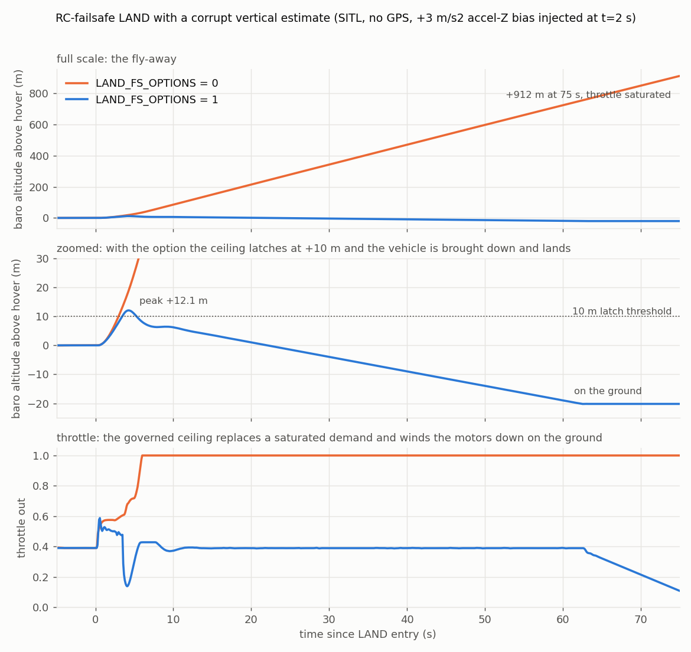

# PR #34210 - Advanced land failsafe (LAND_FS_OPTIONS bit 0)

Analysis archive for [ArduPilot/ardupilot#34210](https://github.com/ArduPilot/ardupilot/pull/34210).
Branch `pr-land-fs-options` (andyp1per fork), base `master`. Everything
committed here is from SITL; the real-flight fly-away this answers is described
generically only.

## Status (one line)

Opened 2026-08-29. Opt-in, default off. The design was reshaped twice by its
own SITL test before submission (see below), which is the reason this archive
exists. Awaiting review; not yet flown.

## The problem

When LAND is entered because of a radio, GCS or EKF failsafe the pilot cannot
intervene. The reported failure was a wrong-sign vertical velocity estimate with
low variance: LAND saw a descent that was not happening, added throttle to
arrest it, and the vehicle climbed away. The stock vibration failsafe exists for
exactly this mechanism but keys on a high velocity variance, which a confident
wrong estimate never shows. The failsafe itself is the right trigger for a
backstop: it has already declared we are flying blind, so the vertical authority
can be bounded without having to detect that the estimate is bad.

## The design, and how the test changed it

With the bit set, two layers engage once the failsafe lands an armed vehicle and
stay engaged for the rest of that landing:

1. The vibration compensation is forced on exactly as `check_vibration()` would
   engage it - the vibration-resistant throttle law *and* the baro-derived
   vertical velocity in the position controller and land detector. A new
   `vibration_check.forced` flag keeps `check_vibration()` the owner of the
   detected state.
2. A baro-only runaway cap: LAND only ever commands a descent, so a net climb of
   more than 10 m on the barometer is a fly-away. That latches a throttle
   ceiling, applied after the vertical controller, governed from the baro climb
   rate (PI on the error from the commanded landing descent).

Three things the runaway test found, in order:

- **A fixed 0.9x-hover ceiling does not descend.** First version. The learned
  hover throttle was 0.44 against a true hover of 0.39 (13% high), so the
  ceiling sat *above* hover and the vehicle kept drifting up at 0.4 m/s after
  the latch (BAlt 39.6 -> 61.6 m over 45 s at ThO 0.40; that log was not kept).
  A learned hover throttle is not a safe reference for a hard floor.
- **A PI ceiling floored at 0.5x hover strands the vehicle armed on the
  ground.** Pre-submission review, verified against the land detector: it needs
  `limit.throttle_lower`, which the mixer only sets at zero thrust. The floor was
  removed and the ceiling now winds down *through* zero on the ground (the
  throttle filter only reaches the lower limit from below), so the motors stop.
- **Forcing the full vibration compensation does not stop the climb on its
  own.** With the baro-derived velocity in the loop the vehicle still climbed
  14 m before the cap latched, because `getVertPosRateD` is a complementary
  filter on the EKF's own height state, which in this scenario has run away too.
  The cap is what brings it down; the forced compensation is what lets the land
  detector work on a sane velocity when the estimate is merely wrong rather than
  gone.

Final numbers: unprotected +912 m in 75 s at full throttle; protected, the
ceiling latches at +10 m, the climb peaks at +12 m, the vehicle is on the
ground at 62 s and the motors are at their minimum by 75 s.

## Known limit, stated in the PR

With the EKF height run away (Alt reading -300 m while on the ground) no
EKF-derived descent rate can read "low", so the land detector never declares
landed and the vehicle stays armed at minimum throttle. The stock vibration
failsafe has the same limit (its autotest force-disarms too). The healthy case
(`ModeLandAdvancedFailsafe`) lands and disarms normally with the bit set.

## Plots

| | |
|---|---|
|  | **A** - option off flies away at saturated throttle; option on latches at +10 m, peaks +12 m, descends at the landing speed and winds the motors down on the ground |

## What is here

```
34210/
  README.md          <- this file
  plots/
    A_runaway_ab.png
    make_plots.py    <- regenerates it from data/
  data/
    option_off.BIN   <- LandFailsafeRunaway, LAND_FS_OPTIONS=0 (earlier build of the branch; the bit-off path is identical)
    option_on.BIN    <- LandFailsafeRunaway, LAND_FS_OPTIONS=1 (final design)
```

Both BINs are SITL (ArduCopter V4.8.0-dev, CMAC default home, hundreds of
`SIM_*` parameters).

## Reproduce

```
python3 plots/make_plots.py

git checkout pr-land-fs-options
./waf configure --board sitl && ./waf copter
Tools/autotest/autotest.py --no-configure test.Copter.LandFailsafeRunaway
Tools/autotest/autotest.py --no-configure test.Copter.ModeLandAdvancedFailsafe
```

The runaway test measures altitude from `SIM_STATE` because the estimate is the
thing being broken; a 1 Hz poll of that is what exposed the 0.9x-hover failure.

## Branches and people

- `pr-land-fs-options` - the PR branch.
- Pre-submission review (single-sourced, Claude subagent) also drove: the
  protections latching for the landing instead of following the failsafe flag,
  an armed-only detector, heli excluded from the cap, `POSCONTROL_THROTTLE_CUTOFF_FREQ_HZ`
  on the clamp, the precision-landing-retry incompatibility documented in the
  parameter description, and the event-driven test.
